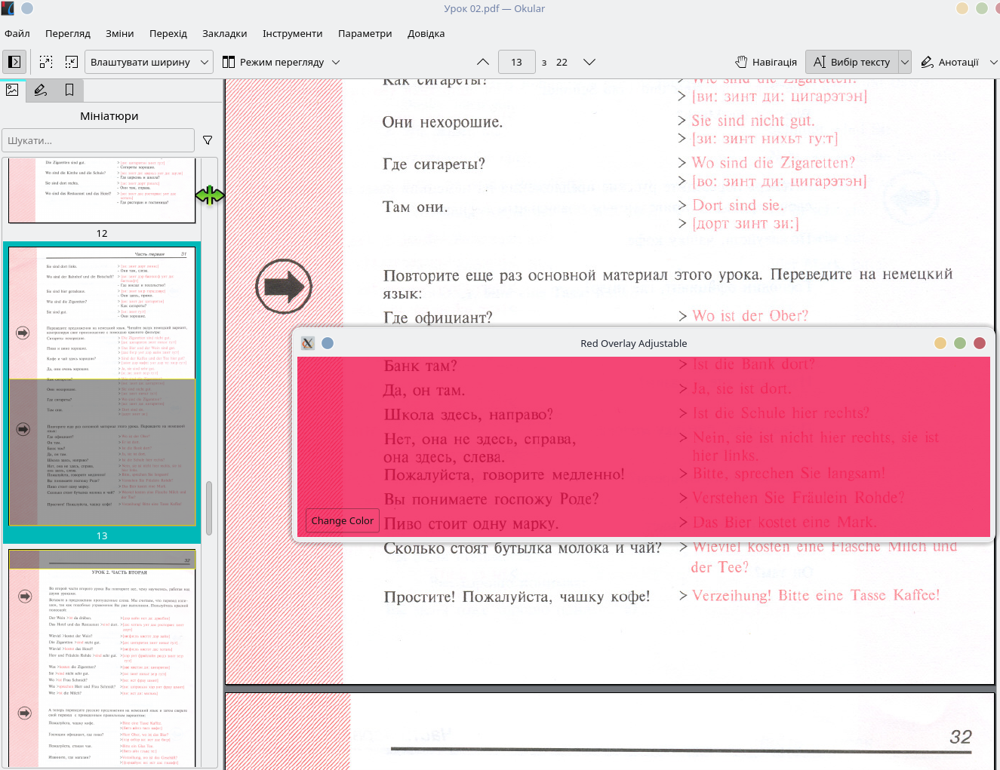

# Red Overlay Transparency Tool

## Overview
The Red Overlay Transparency Tool is a simple yet powerful application designed to assist in reading old educational books where correct answers are printed in red, and other text is in black. This application simulates the effect of using a real red semi-transparent tape to filter out the correct answers, helping users focus on answering questions without seeing the answers first.

Originally, educational books from the early '90s used this method to hide answers. As these books have become available in digital formats such as PDFs, this physical method isn't directly applicable. Our tool brings back this functionality digitally, allowing users to read and interact with educational content as intended.

## Features
- **Dynamic Transparency Adjustment**: Change the overlay transparency using your mouse's scroll wheel to fine-tune visibility.
- **Interactive Color Picker**: Customize the color of the overlay in real time using a built-in color picker, making the tool versatile for different types of documents or personal preferences.
- **Easy-to-Use Interface**: Simple GUI with straightforward options for changing color and transparency.




## Prerequisites
Before you start using the Red Overlay Transparency Tool, ensure you have the following installed on your system:
- Python 3.x
- PyQt5

You can install PyQt5 using pip:
```bash
pip install pyqt5
```

## Usage
To use the Red Overlay Transparency Tool, follow these steps:
1. Clone the repository or download the source code.
2. Navigate to the downloaded directory.
3. Run the script using Python:
   ```bash
   python red_overlay.py
   ```
4. Once the application launches, you will see a window with predefined transparency and color (suitable in most cases)
5. Click the 'Change Color' button to open the color dialog and choose your desired overlay color. Changes in the color picker are reflected in real time but works badly - you need to guess the value, sorry ((
6. Use the mouse scroll wheel over the application window to adjust the transparency of the overlay.

## Contributing
Contributions to enhance or expand the functionality of the Red Overlay Transparency Tool are welcome. If you have suggestions or improvements, feel free to fork the repository and submit a pull request.

## License
This project is open source and available under the [MIT License](LICENSE).

## Acknowledgements
This tool was inspired by the educational practices of the early '90s, specifically designed to aid in self-learning and testing without prematurely revealing answers. We aim to keep this educational tradition alive in the digital age.
```
